# Design Modelling

## UML Models Overview

This document provides comprehensive visual models for the AI Smart Reminder application. The diagrams translate the requirements from [spec.md](.propel/context/docs/spec.md) and architectural decisions from [design.md](.propel/context/docs/design.md) into standard UML representations. The document is organized into two sections: Architectural Views (system context, component, deployment, data flow, ERD, and AI architecture diagrams) and Use Case Sequence Diagrams (one per UC-XXX from spec.md detailing dynamic message flows).

## Architectural Views

### System Context Diagram

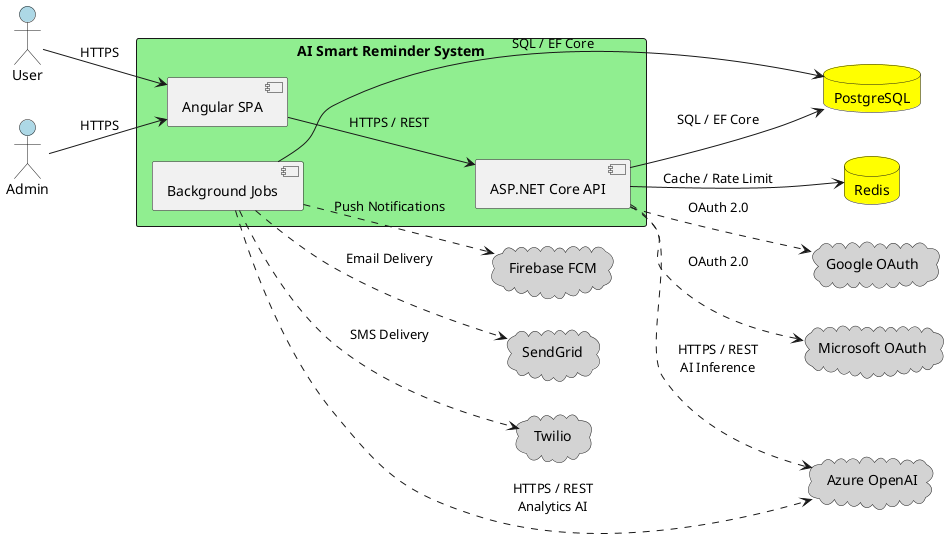

### Component Architecture Diagram

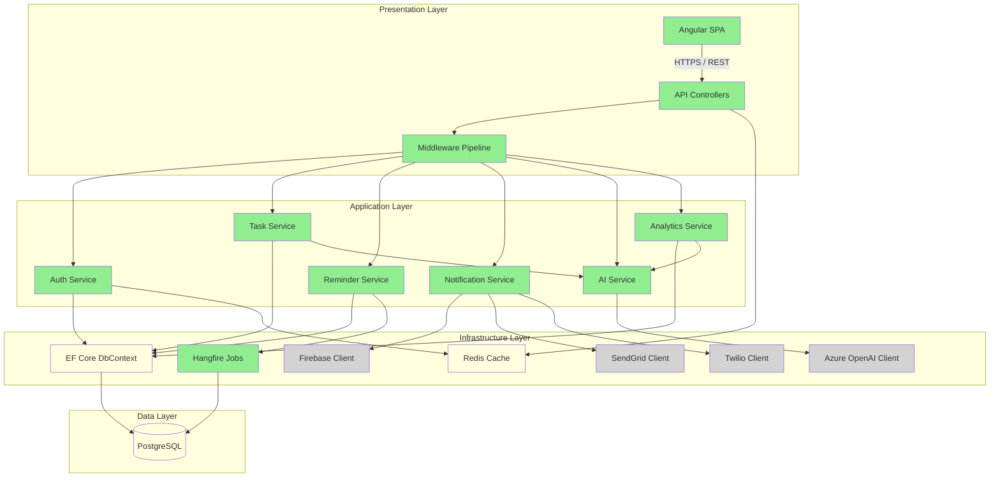

### Deployment Architecture Diagram

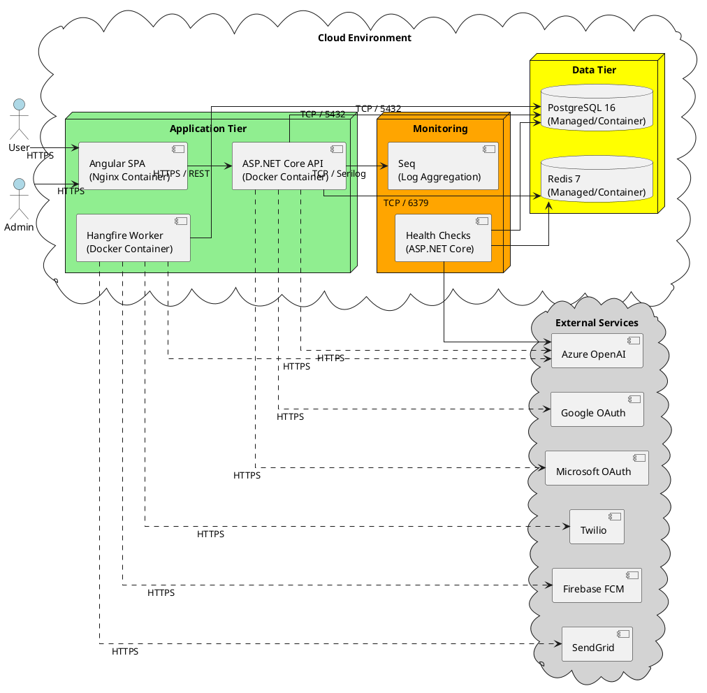

### Data Flow Diagram

```plantuml
@startuml
!define PROCESS rectangle
!define DATASTORE database
!define EXTERNAL component

EXTERNAL "User" as user
EXTERNAL "Admin" as admin
EXTERNAL "Azure OpenAI" as openai
EXTERNAL "Notification Providers" as notif

PROCESS "Authentication\nProcess" as auth_proc
PROCESS "Task Management\nProcess" as task_proc
PROCESS "AI Processing\nProcess" as ai_proc
PROCESS "Reminder Scheduling\nProcess" as reminder_proc
PROCESS "Notification Delivery\nProcess" as notif_proc
PROCESS "Analytics Aggregation\nProcess" as analytics_proc

DATASTORE "User DB" as user_db
DATASTORE "Task DB" as task_db
DATASTORE "Reminder DB" as reminder_db
DATASTORE "Notification DB" as notif_db
DATASTORE "Analytics DB" as analytics_db
DATASTORE "Audit Log DB" as audit_db
DATASTORE "Redis Cache" as cache

user -> auth_proc : Credentials / OAuth token
auth_proc -> user_db : Store / Validate user
auth_proc -> cache : Store JWT blacklist
auth_proc -> audit_db : Log auth event

user -> task_proc : Task CRUD operations
task_proc -> task_db : Store / Retrieve tasks
task_proc -> ai_proc : Request AI categorization
task_proc -> audit_db : Log task action

user -> ai_proc : Natural language input
ai_proc -> openai : Send prompt
openai -> ai_proc : Structured response
ai_proc -> task_proc : Parsed task data

user -> reminder_proc : Reminder configuration
reminder_proc -> reminder_db : Store reminders
reminder_proc -> notif_proc : Trigger notification

notif_proc -> notif : Send push/email/SMS
notif_proc -> notif_db : Track delivery status
notif -> notif_proc : Delivery callback

reminder_proc -> analytics_proc : Reminder response data
task_proc -> analytics_proc : Completion data
analytics_proc -> openai : Request insights
analytics_proc -> analytics_db : Store metrics

admin -> auth_proc : Admin credentials
admin -> analytics_proc : View system health
admin -> audit_db : Review audit logs
@enduml
```

### Logical Data Model (ERD)

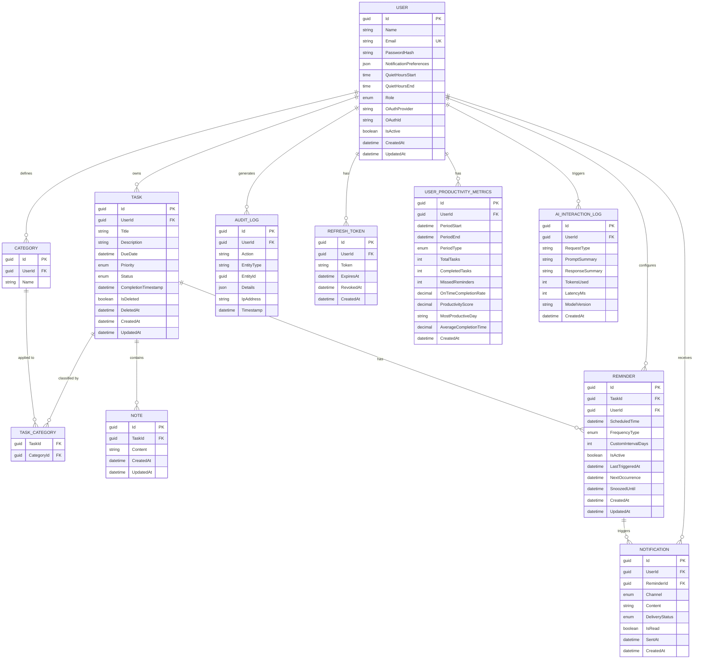

### AI Architecture Diagram

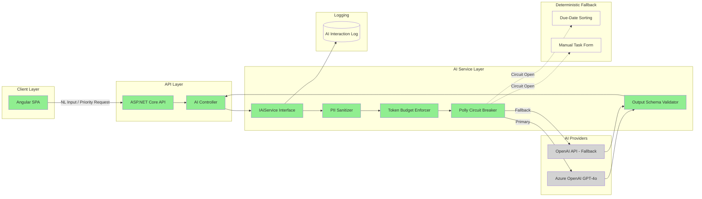

### Use Case Sequence Diagrams

> **Note**: Each sequence diagram below details the dynamic message flow for its corresponding use case from [spec.md](.propel/context/docs/spec.md). Use case diagrams (actor-goal relationships) remain in spec.md only.

#### UC-001: User Registration and Authentication

**Source**: [spec.md#UC-001](.propel/context/docs/spec.md#UC-001)

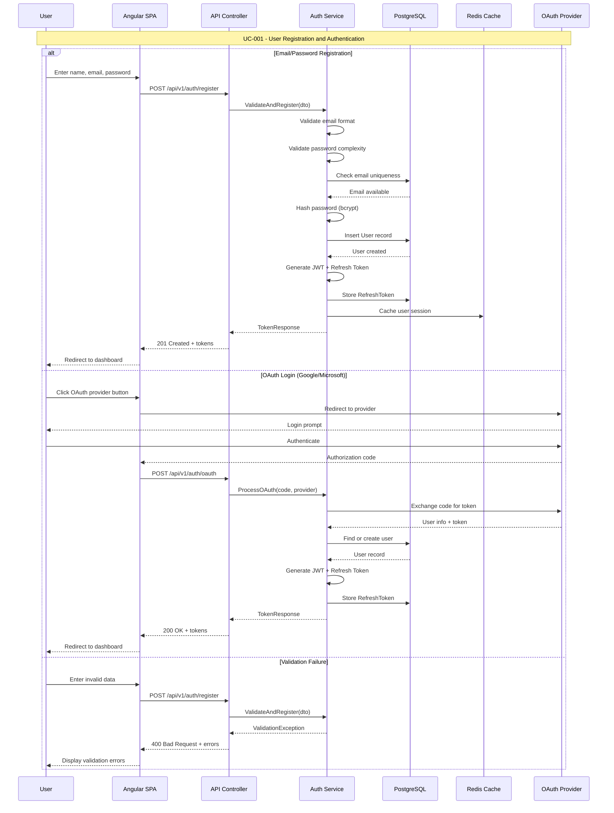

#### UC-002: Task Lifecycle Management

**Source**: [spec.md#UC-002](.propel/context/docs/spec.md#UC-002)

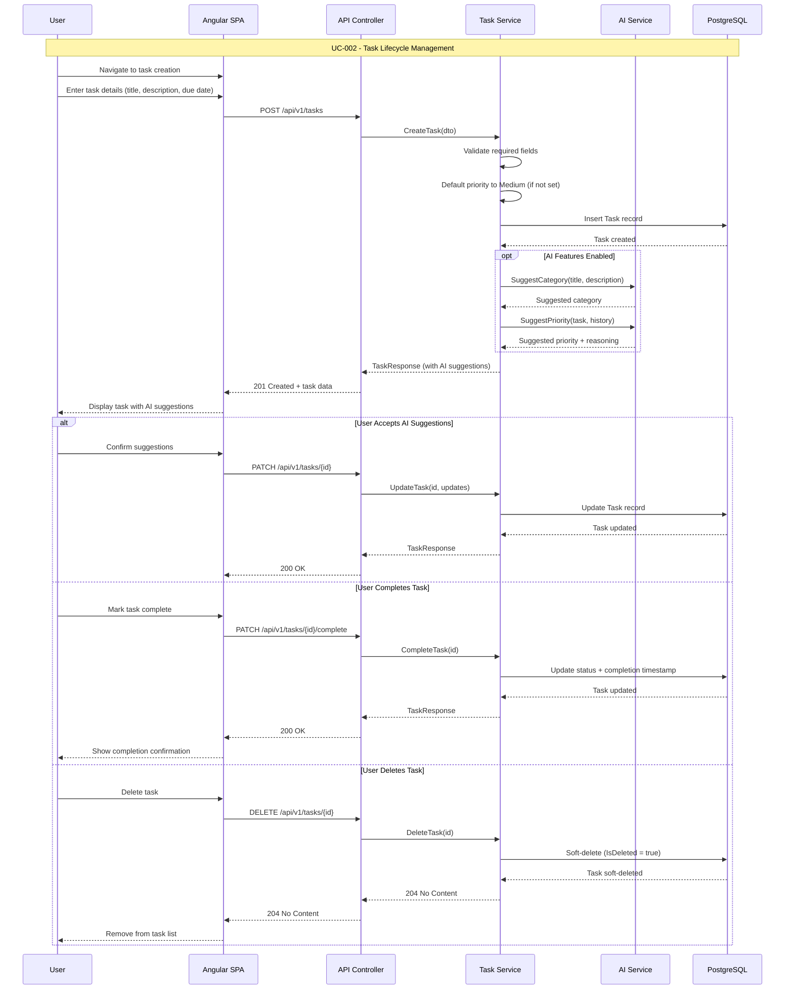

#### UC-003: Reminder Configuration and Delivery

**Source**: [spec.md#UC-003](.propel/context/docs/spec.md#UC-003)

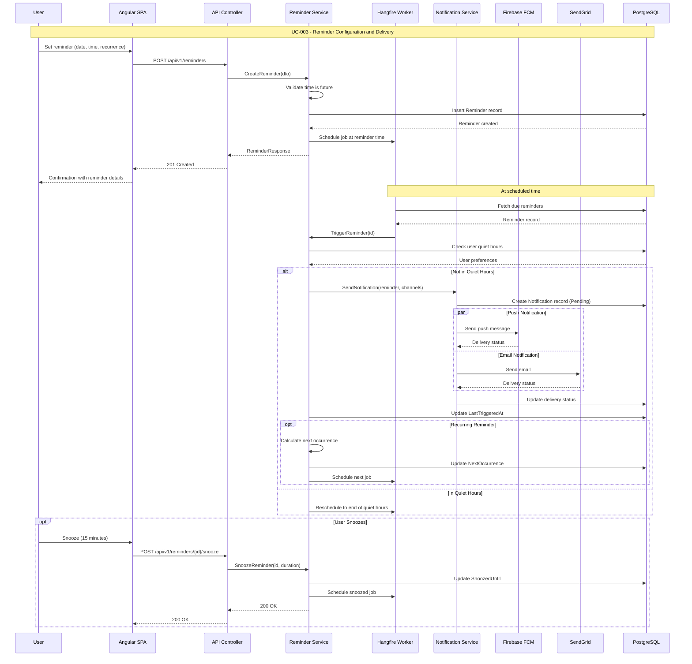

#### UC-004: Natural Language Task Creation

**Source**: [spec.md#UC-004](.propel/context/docs/spec.md#UC-004)

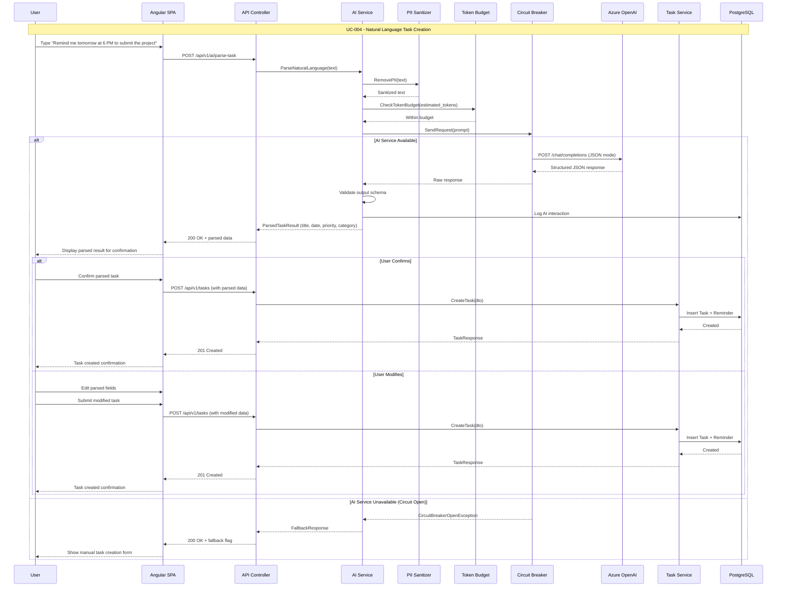

#### UC-005: AI-Powered Task Prioritization

**Source**: [spec.md#UC-005](.propel/context/docs/spec.md#UC-005)

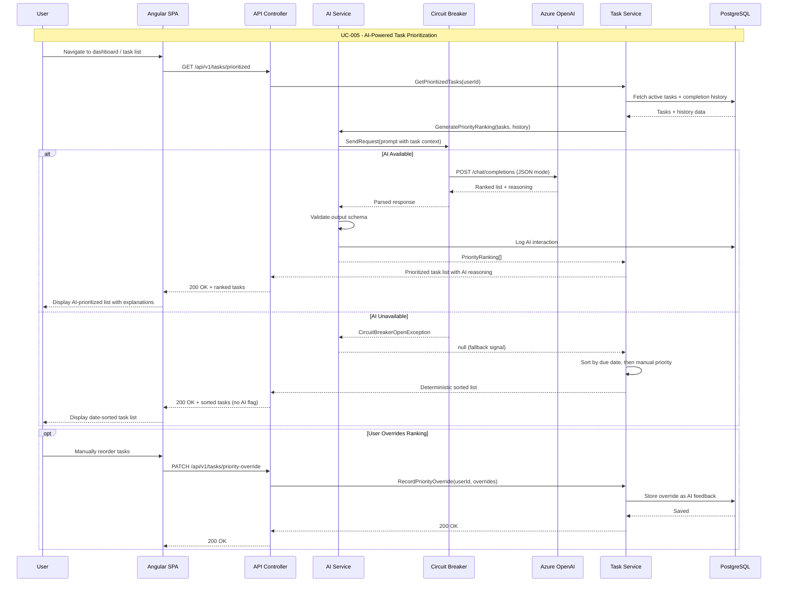

#### UC-006: Productivity Analytics Review

**Source**: [spec.md#UC-006](.propel/context/docs/spec.md#UC-006)

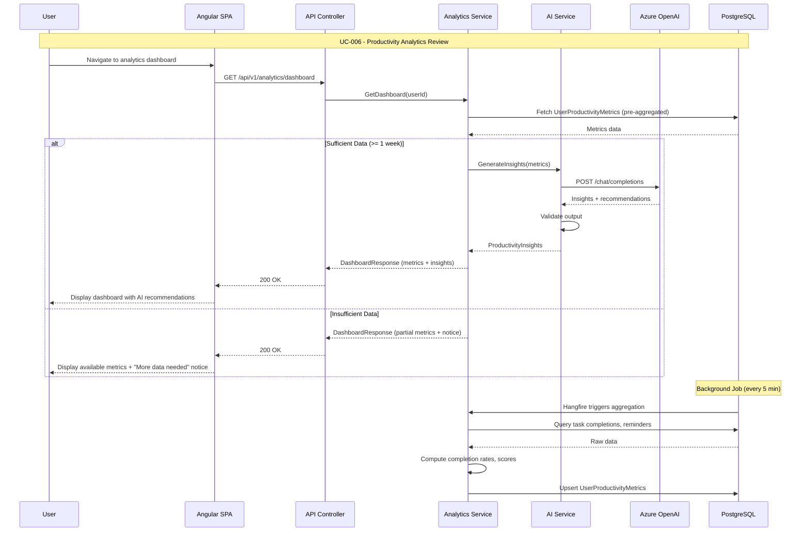

#### UC-007: Notification Management

**Source**: [spec.md#UC-007](.propel/context/docs/spec.md#UC-007)

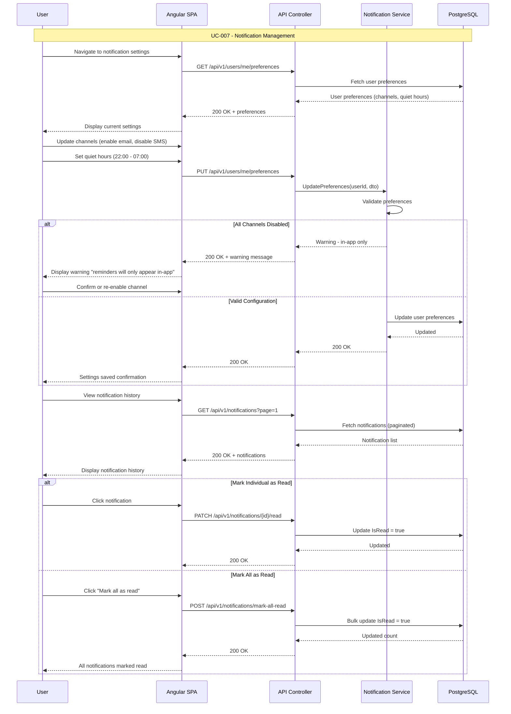

#### UC-008: Admin System Management

**Source**: [spec.md#UC-008](.propel/context/docs/spec.md#UC-008)

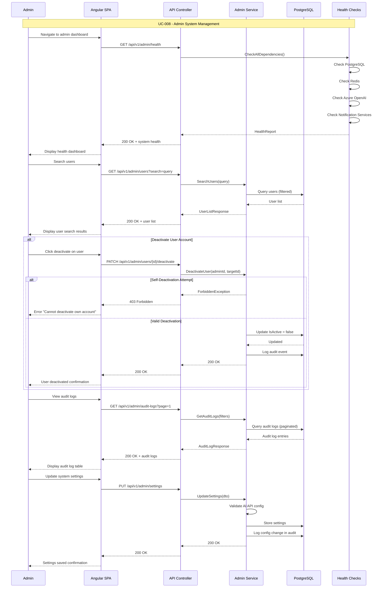
