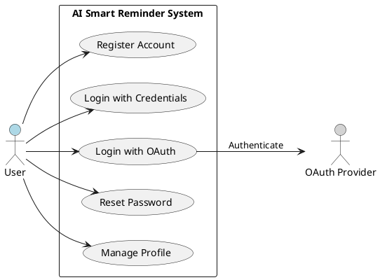
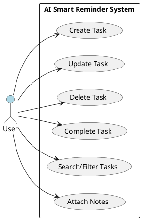
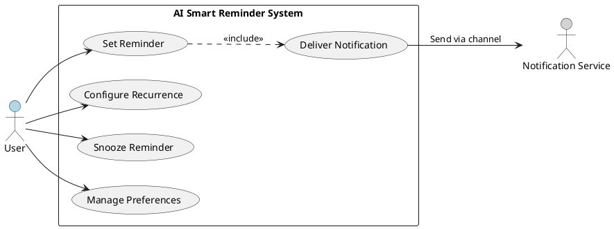
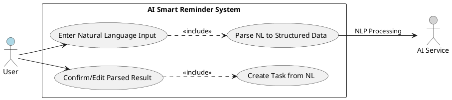
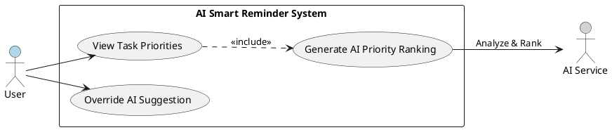
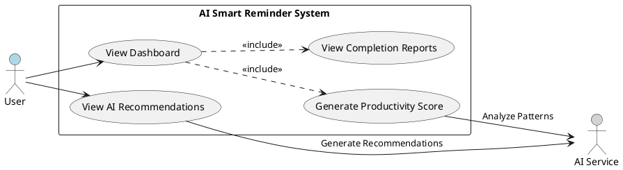
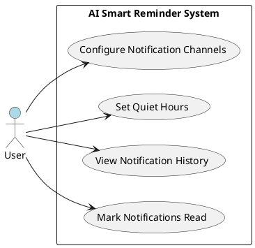
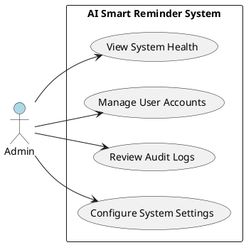

## Feature Goal

Build an AI-powered to-do list and reminder application that goes beyond traditional task management by integrating intelligent scheduling, smart prioritization, natural language task creation, and personalized productivity insights. The system will support task CRUD operations, multi-channel reminders, AI-driven recommendations, and an analytics dashboard — delivered as a responsive Angular web application backed by a .NET Web API with PostgreSQL persistence and OpenAI/Azure OpenAI integration.

**Current State:** No existing application. Greenfield project.

**Desired End State:** A fully functional, production-ready web application where users can manage tasks and reminders with AI-powered enhancements including NLP task creation, smart prioritization, optimized reminder timing, and productivity analytics.

## Business Justification

- **Business Value:** Delivers a differentiated product in the crowded task management market by leveraging AI for intelligent scheduling and productivity insights, targeting working professionals, students, freelancers, and small teams
- **User Impact:** Reduces missed tasks and reminders by learning user behavior patterns and optimizing notification timing; improves productivity through AI-suggested task prioritization and categorization
- **Integration with Existing Features:** Designed as modular, microservice-ready architecture supporting future mobile app integration (Flutter/React Native), calendar sync, team collaboration, and voice assistant features
- **Problems Solved:** Eliminates manual task prioritization guesswork, reduces notification fatigue through smart timing, automates task categorization, and provides actionable productivity insights — addressing pain points for users who struggle with traditional, passive to-do applications

## Feature Scope

### User-Visible Behavior

- Users register, log in (email/password or OAuth via Google/Microsoft), and manage their profile
- Users create tasks manually or via natural language input (e.g., "Remind me tomorrow at 6 PM to submit the project")
- Tasks support titles, descriptions, due dates, priorities (High/Medium/Low), categories, notes, and completion status
- System provides AI-suggested task priorities and auto-categorization with user confirmation
- Users configure time-based and recurring reminders (daily, weekly, monthly, custom)
- Notifications delivered via push, email, and SMS channels based on user preferences
- AI optimizes reminder timing based on learned user productivity patterns
- Dashboard displays productivity score, completion rates, missed reminders, and weekly insights
- Admin users manage user accounts and monitor system health

### Technical Requirements

- Angular frontend with modular architecture (Core, Shared, Feature modules)
- .NET Web API backend with Clean Architecture (Controllers, Services, Repositories, DTOs)
- PostgreSQL database with Entity Framework Core ORM
- JWT authentication with refresh tokens; OAuth 2.0 for social login
- OpenAI/Azure OpenAI API integration for NLP and AI features
- Firebase/Email/SMS notification service integration
- Optional Redis caching layer
- Background job processing for reminder scheduling and AI tasks
- RESTful API design with rate limiting, input validation, HTTPS

### Success Criteria

- [ ] Users can register, log in (JWT + OAuth), and manage profiles
- [ ] Full task CRUD with priority, categories, notes, and due dates
- [ ] Recurring reminders (daily/weekly/monthly/custom) trigger on schedule
- [ ] Multi-channel notifications (push, email) delivered reliably
- [ ] AI natural language input correctly parsed into structured tasks with > 85% accuracy
- [ ] AI priority suggestions accepted by users > 40% of the time
- [ ] API response time < 3 seconds for all endpoints
- [ ] System maintains 99.9% uptime
- [ ] Responsive UI works across desktop and mobile browsers
- [ ] Productivity dashboard displays accurate analytics

## Functional Requirements

### AI Suitability Triage Summary

This is a **HYBRID** project. Core task management and authentication are deterministic. The differentiating AI features (NLP parsing, smart prioritization, productivity insights) are AI-powered. Several features use a hybrid approach where AI suggests and users confirm.

| Category | Count | Examples |
|---|---|---|
| DETERMINISTIC | 30 | Auth, Task CRUD, Reminder scheduling, Notifications |
| AI-CANDIDATE | 9 | NLP task creation, Smart prioritization, Categorization |
| HYBRID | 7 | AI-suggested priority, Optimized reminder timing, Reports |

### Authentication Module

- FR-001: [DETERMINISTIC] System MUST allow users to register with name, email, and password, validating email format and enforcing password complexity (minimum 8 characters, uppercase, lowercase, number, special character)
- FR-002: [DETERMINISTIC] System MUST authenticate users via email and password, issuing a JWT access token and refresh token upon successful login
- FR-003: [DETERMINISTIC] System MUST invalidate the current session and revoke the refresh token when a user logs out
- FR-004: [DETERMINISTIC] System MUST allow users to request a password reset via email, sending a time-limited reset link (valid for 60 minutes)
- FR-005: [DETERMINISTIC] System MUST support OAuth 2.0 login via Google and Microsoft identity providers, creating a local account on first login
- FR-006: [DETERMINISTIC] System MUST issue a new access token when a valid refresh token is presented, and reject expired or revoked refresh tokens
- FR-007: [DETERMINISTIC] System MUST allow authenticated users to view and update their profile (name, email, notification preferences)

### Task Management Module

- FR-008: [DETERMINISTIC] System MUST allow authenticated users to create a task with required fields (title) and optional fields (description, due date, priority, category, notes)
- FR-009: [DETERMINISTIC] System MUST allow task owners to update any field of an existing task
- FR-010: [DETERMINISTIC] System MUST allow task owners to delete a task (soft delete), retaining data for analytics purposes
- FR-011: [DETERMINISTIC] System MUST allow task owners to mark a task as completed, recording the completion timestamp
- FR-012: [DETERMINISTIC] System MUST support task priority levels of High, Medium, and Low, defaulting to Medium when not specified
- FR-013: [DETERMINISTIC] System MUST allow users to assign one or more categories to a task from a user-defined category list
- FR-014: [DETERMINISTIC] System MUST allow users to attach text notes to a task, supporting create, update, and delete of notes
- FR-015: [DETERMINISTIC] System MUST allow users to list tasks with filtering by status (active, completed, all), priority, category, and due date range, with sorting by due date, priority, or creation date
- FR-016: [DETERMINISTIC] System MUST allow users to search tasks by keyword matching against title and description fields
- FR-017: [AI-CANDIDATE] System MUST auto-suggest a category for a task based on its title and description using AI classification, presenting the suggestion for user confirmation
- FR-018: [HYBRID] System MUST provide AI-suggested task priority based on deadline proximity, task description analysis, and user completion history, allowing the user to accept or override the suggestion

### Reminder Module

- FR-019: [DETERMINISTIC] System MUST allow users to create a time-based reminder associated with a task, specifying the exact date and time for the reminder
- FR-020: [DETERMINISTIC] System MUST support recurring reminders with frequency types: daily, weekly, monthly, and custom (user-defined interval in days)
- FR-021: [DETERMINISTIC] System MUST allow users to update the time, frequency, or associated task of an existing reminder, and to delete reminders
- FR-022: [DETERMINISTIC] System MUST trigger reminder notifications at the scheduled time, processing reminders within a 1-minute accuracy window
- FR-023: [HYBRID] System MUST suggest optimal reminder times based on AI analysis of user activity patterns and historical task completion times, allowing users to accept or modify the suggested time
- FR-024: [DETERMINISTIC] System MUST allow users to snooze a triggered reminder by 5, 15, 30, or 60 minutes, or a custom duration
- FR-025: [DETERMINISTIC] System MUST display a list of upcoming reminders for the authenticated user, sorted by scheduled time

### Notification Module

- FR-026: [DETERMINISTIC] System MUST send push notifications to the user's registered devices when a reminder is triggered
- FR-027: [DETERMINISTIC] System MUST send email notifications for reminders when the user has enabled email notification preference
- FR-028: [DETERMINISTIC] System MUST allow users to mark individual notifications as read, and support a "mark all as read" action
- FR-029: [DETERMINISTIC] System MUST allow users to configure notification preferences per channel (push, email, SMS) including quiet hours during which no notifications are sent
- FR-030: [DETERMINISTIC] System MUST maintain a notification history for each user, displaying message content, delivery channel, delivery status, and timestamp

### AI Features Module

- FR-031: [AI-CANDIDATE] System MUST accept natural language text input (e.g., "Remind me tomorrow at 6 PM to submit the project") and extract structured task data: task title, reminder date, reminder time, and suggested priority
- FR-032: [AI-CANDIDATE] System MUST analyze task deadlines, user behavior patterns, task history, and completion trends to generate a ranked list of tasks ordered by suggested completion priority
- FR-033: [AI-CANDIDATE] System MUST automatically classify tasks into categories (e.g., Work, Personal, Health, Finance) based on task title and description content using AI text classification
- FR-034: [AI-CANDIDATE] System MUST learn user productivity patterns (active hours, typical completion times) and suggest optimal reminder scheduling windows
- FR-035: [AI-CANDIDATE] System MUST generate productivity insights including most productive day of week, average completion rate, missed reminder count, and weekly productivity score
- FR-036: [HYBRID] System MUST present AI-generated productivity recommendations (e.g., "You complete more tasks in the morning — schedule important tasks before noon") for user review and optional action
- FR-037: [AI-CANDIDATE] System MUST parse natural language date/time expressions (e.g., "tomorrow morning", "next Friday at 3 PM", "end of month") into precise datetime values with timezone awareness

### Analytics Module

- FR-038: [HYBRID] System MUST calculate a weekly and monthly productivity score based on task completion rate, on-time completion percentage, and reminder response rate, presenting the score on the user dashboard
- FR-039: [DETERMINISTIC] System MUST track and display task completion rates over configurable time periods (daily, weekly, monthly)
- FR-040: [DETERMINISTIC] System MUST track and display the count and percentage of missed reminders over configurable time periods
- FR-041: [HYBRID] System MUST generate weekly and monthly productivity reports combining deterministic metrics with AI-generated insights and trend analysis
- FR-042: [DETERMINISTIC] System MUST aggregate dashboard data (total tasks, completed tasks, pending tasks, overdue tasks, upcoming reminders) and refresh at minimum every 5 minutes

### Admin Module

- FR-043: [DETERMINISTIC] System MUST allow admin users to view, search, activate, and deactivate user accounts
- FR-044: [DETERMINISTIC] System MUST provide admin users with a system health dashboard showing API response times, error rates, active users, and background job status
- FR-045: [DETERMINISTIC] System MUST maintain an audit log of user actions (login, task creation, task deletion, setting changes) accessible to admin users
- FR-046: [DETERMINISTIC] System MUST allow admin users to configure system-wide settings including notification service parameters, AI API configuration, and rate limiting thresholds

## Use Case Analysis

### Actors & System Boundary

- **User (Primary Actor)**: Authenticated end user who creates and manages tasks, sets reminders, and views productivity analytics
- **Admin (Primary Actor)**: System administrator who manages user accounts, monitors system health, and configures system settings
- **AI Service (System Actor)**: External AI API (OpenAI/Azure OpenAI) that processes NLP inputs, generates priority suggestions, categorizes tasks, and produces productivity insights
- **Notification Service (System Actor)**: External services (Firebase, Email provider, SMS gateway) that deliver reminder notifications across channels
- **OAuth Provider (System Actor)**: External identity providers (Google, Microsoft) that authenticate users via OAuth 2.0

### Use Case Specifications

#### UC-001: User Registration and Authentication

- **Actor(s)**: User, OAuth Provider
- **Goal**: User creates an account and authenticates to access the application
- **Preconditions**: Application is accessible; OAuth providers are configured
- **Success Scenario**:
  1. User navigates to the registration page
  2. User enters name, email, and password
  3. System validates email format and password complexity
  4. System creates the user account and stores hashed password
  5. System issues JWT access token and refresh token
  6. User is redirected to the dashboard
- **Extensions/Alternatives**:
  - 2a. User selects OAuth login (Google/Microsoft) instead of email/password
    - 2a1. System redirects to OAuth provider
    - 2a2. User authenticates with OAuth provider
    - 2a3. System receives OAuth token and creates/links local account
    - 2a4. Continue from step 5
  - 3a. Validation fails (invalid email or weak password)
    - 3a1. System displays specific validation error messages
    - 3a2. User corrects input and resubmits
  - 4a. Email already registered
    - 4a1. System displays "email already in use" error
    - 4a2. User attempts login or password reset instead
- **Postconditions**: User account exists; user has valid session tokens

##### Use Case Diagram

#### UC-002: Task Lifecycle Management

- **Actor(s)**: User
- **Goal**: User creates, manages, and completes tasks with full lifecycle support
- **Preconditions**: User is authenticated
- **Success Scenario**:
  1. User navigates to the task creation form
  2. User enters task title and optional details (description, due date, priority, category, notes)
  3. System validates required fields and creates the task
  4. System displays the task in the user's task list
  5. User updates task details as needed
  6. User marks the task as completed
  7. System records completion timestamp and updates analytics
- **Extensions/Alternatives**:
  - 2a. User does not set priority
    - 2a1. System defaults priority to Medium
  - 3a. AI suggests category and priority (if AI features enabled)
    - 3a1. System displays AI suggestions with accept/override options
    - 3a2. User accepts or modifies suggestions
  - 5a. User deletes the task
    - 5a1. System soft-deletes the task
    - 5a2. Task is removed from active list but retained for analytics
  - 5b. User attaches or updates notes on the task
    - 5b1. System saves note content linked to the task
- **Postconditions**: Task exists in the system with current state (active/completed/deleted)

##### Use Case Diagram

#### UC-003: Reminder Configuration and Delivery

- **Actor(s)**: User, Notification Service
- **Goal**: User configures reminders for tasks and receives timely notifications
- **Preconditions**: User is authenticated; at least one task exists
- **Success Scenario**:
  1. User selects a task and opens the reminder configuration
  2. User sets a reminder date, time, and optional recurrence (daily/weekly/monthly/custom)
  3. System validates the reminder time is in the future and creates the reminder
  4. System schedules the reminder in the background job processor
  5. At the scheduled time, system triggers the reminder
  6. System sends notifications via user's preferred channels (push, email, SMS)
  7. User receives the notification and acknowledges it
- **Extensions/Alternatives**:
  - 2a. User modifies an existing reminder
    - 2a1. System updates the schedule and reschedules the background job
  - 5a. Notification delivery fails on primary channel
    - 5a1. System retries delivery up to 3 times with exponential backoff
    - 5a2. System attempts fallback channel if primary fails
  - 7a. User snoozes the reminder
    - 7a1. User selects snooze duration (5/15/30/60 minutes or custom)
    - 7a2. System reschedules the reminder for the snooze duration
  - 7b. Reminder falls within user's quiet hours
    - 7b1. System defers notification to the end of quiet hours
- **Postconditions**: Reminder has been triggered and notification delivered; recurring reminders are rescheduled for next occurrence

##### Use Case Diagram

#### UC-004: Natural Language Task Creation

- **Actor(s)**: User, AI Service
- **Goal**: User creates a task by typing a natural language sentence that the AI parses into structured task data
- **Preconditions**: User is authenticated; AI Service is available
- **Success Scenario**:
  1. User types a natural language instruction (e.g., "Remind me tomorrow at 6 PM to submit the project")
  2. System sends the text to the AI Service for NLP processing
  3. AI Service extracts: task title, reminder date/time, suggested category, suggested priority
  4. System presents the parsed result to the user for confirmation
  5. User reviews and confirms (or modifies) the extracted data
  6. System creates the task and associated reminder
- **Extensions/Alternatives**:
  - 2a. AI Service is unavailable
    - 2a1. System displays an error message and offers manual task creation form
    - 2a2. User creates the task manually
  - 3a. AI cannot parse the input with confidence
    - 3a1. System presents partial extraction with highlighted uncertain fields
    - 3a2. User manually fills in or corrects uncertain fields
  - 5a. User rejects the AI parsing and edits all fields manually
    - 5a1. System pre-fills the form with AI suggestions as editable defaults
- **Postconditions**: Task and optional reminder are created with user-confirmed data

##### Use Case Diagram

#### UC-005: AI-Powered Task Prioritization

- **Actor(s)**: User, AI Service
- **Goal**: User receives AI-generated task priority rankings to focus on the most important tasks
- **Preconditions**: User is authenticated; user has at least 2 active tasks; AI Service is available
- **Success Scenario**:
  1. User navigates to the dashboard or task list
  2. System sends user's active tasks, deadlines, and completion history to the AI Service
  3. AI Service analyzes tasks and returns a priority-ranked list with reasoning
  4. System displays the prioritized task list with AI explanations (e.g., "Due tomorrow, historically completed similar tasks in morning")
  5. User reviews the suggestions and optionally reorders tasks
- **Extensions/Alternatives**:
  - 2a. AI Service is unavailable
    - 2a1. System falls back to deterministic sorting (by due date, then by manual priority)
  - 5a. User disagrees with AI ranking
    - 5a1. User manually adjusts task order
    - 5a2. System records the override as feedback for future AI training
- **Postconditions**: User has a prioritized view of tasks; AI feedback is recorded

##### Use Case Diagram

#### UC-006: Productivity Analytics Review

- **Actor(s)**: User, AI Service
- **Goal**: User reviews productivity insights and AI-generated recommendations to improve task management habits
- **Preconditions**: User is authenticated; user has task completion history (minimum 1 week of data)
- **Success Scenario**:
  1. User navigates to the analytics dashboard
  2. System aggregates task completion data, reminder response data, and time-series metrics
  3. System sends aggregated data to the AI Service for insight generation
  4. AI Service returns productivity score, trend analysis, and personalized recommendations
  5. System displays the dashboard with metrics (completion rate, missed reminders, most productive day) and AI recommendations
  6. User reviews insights and optionally acts on recommendations
- **Extensions/Alternatives**:
  - 3a. AI Service is unavailable
    - 3a1. System displays only deterministic metrics (completion rate, counts, trends)
    - 3a2. AI recommendation section shows "Insights temporarily unavailable"
  - 2a. Insufficient data (less than 1 week)
    - 2a1. System displays available metrics with a notice: "More data needed for full insights"
- **Postconditions**: User has viewed current productivity metrics and AI recommendations

##### Use Case Diagram

#### UC-007: Notification Management

- **Actor(s)**: User
- **Goal**: User manages notification preferences and reviews notification history
- **Preconditions**: User is authenticated
- **Success Scenario**:
  1. User navigates to notification settings
  2. User configures preferred channels (push, email, SMS) and quiet hours
  3. System saves notification preferences
  4. User views notification history with delivery status
  5. User marks notifications as read individually or in bulk
- **Extensions/Alternatives**:
  - 2a. User disables all notification channels
    - 2a1. System warns user that reminders will only appear in-app
    - 2a2. User confirms or re-enables at least one channel
- **Postconditions**: User notification preferences are saved; notification history is accessible

##### Use Case Diagram

#### UC-008: Admin System Management

- **Actor(s)**: Admin
- **Goal**: Admin manages user accounts, monitors system health, and configures system settings
- **Preconditions**: Admin is authenticated with admin role
- **Success Scenario**:
  1. Admin navigates to the admin dashboard
  2. Admin views system health metrics (API response times, error rates, active users, job status)
  3. Admin searches for and views user accounts
  4. Admin activates or deactivates a user account as needed
  5. Admin reviews audit logs for user activity
  6. Admin configures system settings (notification parameters, AI API config, rate limits)
- **Extensions/Alternatives**:
  - 4a. Admin attempts to deactivate their own account
    - 4a1. System prevents self-deactivation and displays an error
  - 6a. Admin changes AI API configuration
    - 6a1. System validates the new API configuration before saving
    - 6a2. System logs the configuration change in the audit log
- **Postconditions**: System state reflects admin actions; audit log updated

##### Use Case Diagram

## Risks & Mitigations

| Risk | Impact | Likelihood | Mitigation |
|---|---|---|---|
| AI API service downtime or latency spikes degrade NLP task creation and smart prioritization features | High | Medium | Implement circuit breaker pattern, fallback to manual task creation, cache recent AI responses, set timeout thresholds |
| Notification delivery failures across push, email, and SMS channels due to provider outages or device variability | High | Medium | Multi-channel delivery with retry logic (3 attempts, exponential backoff), fallback to alternate channel, delivery status tracking and alerting |
| Time zone and DST handling errors cause reminders to trigger at incorrect times | Medium | Medium | Store all timestamps in UTC, compute display times on client, comprehensive time zone testing, use IANA timezone database |
| AI classification inaccuracy leads to wrong task categories or priority suggestions, eroding user trust | Medium | Medium | Present AI outputs as suggestions requiring user confirmation (HYBRID pattern), implement feedback loop recording user overrides, retrain models periodically |
| Background reminder processing cannot scale to handle concurrent reminder load during peak hours | High | Low | Distributed job processing architecture, horizontal scaling of worker nodes, queue-based processing with backpressure, performance load testing |

## Constraints & Assumptions

| Type | Description | Rationale |
|---|---|---|
| Constraint | Initial release targets web-only (Angular SPA); native mobile applications are deferred to a future phase | Focus MVP delivery on a single platform to reduce complexity and timeline; modular API design ensures mobile readiness |
| Constraint | AI features depend on external API availability (OpenAI/Azure OpenAI) and incur per-token costs | No in-house ML infrastructure; cost management requires token budgeting and caching strategies |
| Assumption | Users have reliable internet access; offline mode is not supported in the initial release | Web-first approach; offline support adds significant complexity (sync, conflict resolution) deferred to future phases |
| Assumption | Email and SMS notification providers are pre-configured and operational before deployment | Notification service integration is a deployment prerequisite; provider selection is an infrastructure decision |
| Constraint | PostgreSQL is the single source of truth; Redis is an optional caching layer, not a primary data store | Ensures data consistency and simplifies backup/recovery; Redis enhances performance but is not required for correctness |
